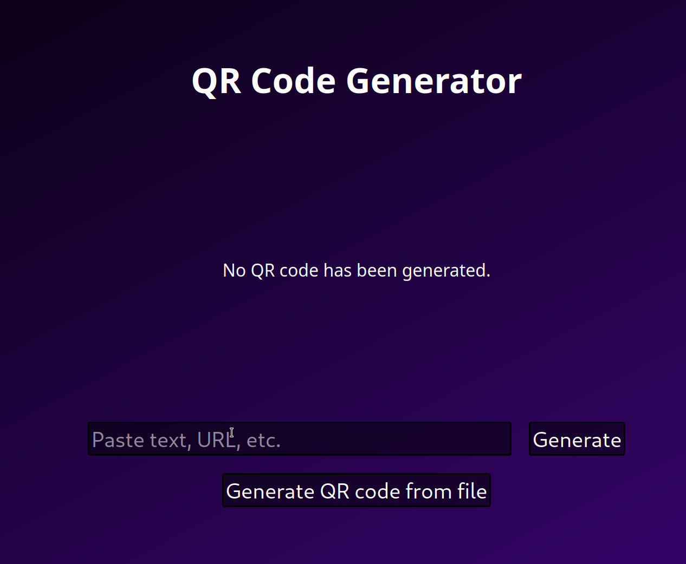

# qr-portal2d

 

Simple browser QR code generator. Hosted at [qr.portal2d.xyz](https://qr.portal2d.xyz)

## Features

* it generates qr codes

* it lets you download qr codes

* everything is client-side (no server needed, no login needed)

## Building

1. clone

```
git clone https://github.com/RainbowAsteroids/qr-portal2d
cd qr-portal2d
```

2. get rust

```
curl --proto '=https' --tlsv1.2 -sSf https://sh.rustup.rs | sh
```

3. get trunk

```
cargo install trunk
```

4. build

```
trunk build --release
```

5. deploy

```
sudo cp dist/* /var/www/<blah>
```
